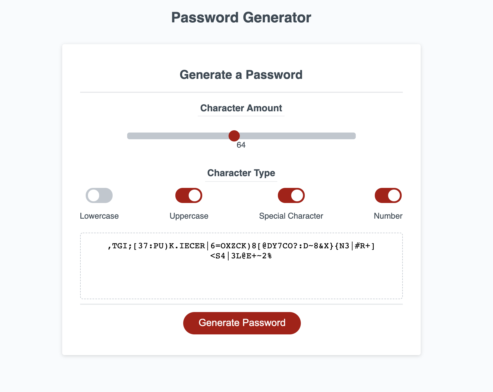

# Password Generator
#### Password Generator Project for UofR Full Stack Bootcamp Due: DEC 19th 2021
#### * Grader Please Note * I added a UI to replace prompts with Slider and Toggles.
## Link to Live Project : https://haguermeister.github.io/password-generator/
## Screenshot of Project Below :

## User Story :
#### AS AN employee with access to sensitive data
#### I WANT to randomly generate a password that meets certain criteria
#### SO THAT I can create a strong password that provides greater security

## Acceptance Criteria :
#### GIVEN I need a new, secure password
#### WHEN I click the button to generate a password 
#### THEN I am presented with a series of prompts for password criteria XXX
#### WHEN prompted for password criteria
#### THEN I select which criteria to include in the password XXX
#### WHEN prompted for the length of the password
#### THEN I choose a length of at least 8 characters and no more than 128 characters XXX
#### WHEN asked for character types to include in the password
#### THEN I confirm whether or not to include lowercase, uppercase, numeric, and/or special characters XXX
#### WHEN I answer each prompt
#### THEN my input should be validated and at least one character type should be selected XXX
#### WHEN all prompts are answered
#### THEN a password is generated that matches the selected criteria XX
#### WHEN the password is generated
#### THEN the password is either displayed in an alert or written to the page XXX